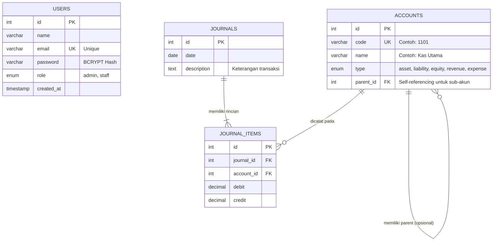
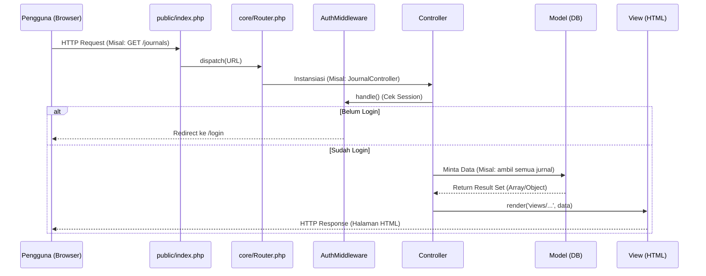

# Diagram Sistem Akuntansi Koperasi

Dokumen ini memuat diagram arsitektur dan relasi database untuk mempermudah pemahaman alur kerja aplikasi. Diagram direpresentasikan menggunakan sintaks **Mermaid**.

## 1. Entity Relationship Diagram (ERD)
Diagram ini menunjukkan struktur tabel di dalam database MySQL beserta relasi antar tabelnya.

**Penjelasan Relasi Database:**
- Satu transaksi **Jurnal** (`journals`) harus memiliki satu atau lebih rincian **Item Jurnal** (`journal_items`).
- Setiap **Item Jurnal** (`journal_items`) wajib merujuk pada satu **Bagan Akun** (`accounts`) tertentu.
- Tabel **Accounts** memiliki relasi *self-referencing* (`parent_id`) untuk mendukung hierarki akun bertingkat.

---

## 2. Diagram Alur MVC (Model-View-Controller)
Diagram ini menjelaskan perjalanan sebuah *HTTP Request* dari pengguna hingga menghasilkan halaman web (*HTTP Response*).

**Penjelasan Alur MVC:**
1. Semua permintaan (Request) masuk ke `public/index.php` sebagai *Front Controller*.
2. `Router` akan membedah URL dan mencari `Controller` mana yang bertugas.
3. Sebelum memproses logika, Controller akan memanggil `AuthMiddleware` untuk memastikan user berhak mengakses.
4. Jika aman, Controller akan meminta data dari `Model` (berinteraksi dengan Singleton Database).
5. Data yang didapat dari Model akan dikirim ke `View` untuk dirangkai menjadi HTML, lalu dikirim balik ke Pengguna.
